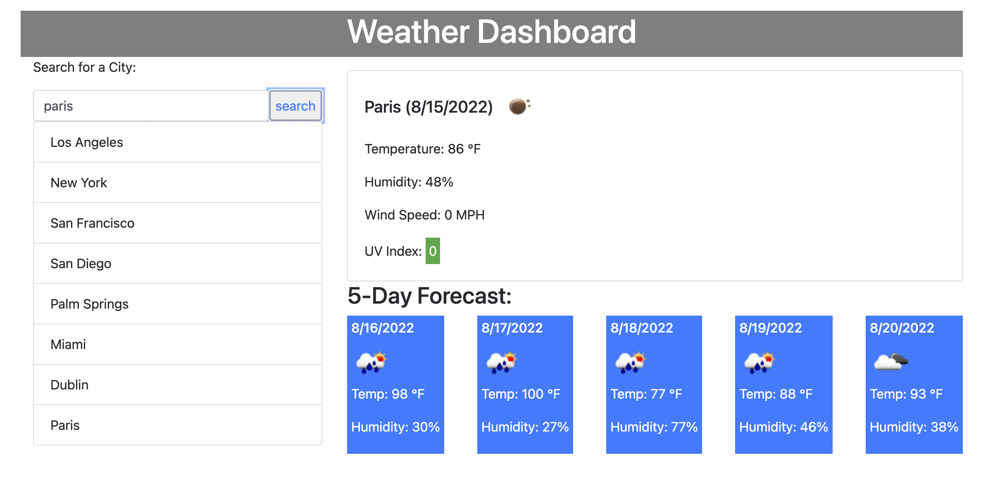

# Weather_Dashboard_ChallengeSix

Description:

A simple weather URL that gives you current temprature, humidity, 
wind speed, and UV index with a color coded warning.

User Story:

As a traveler I want to see the current and 5 day weather forecast for multiple citites so I can plan a trip accordingly.

How to use:

Visit website URL. 

Website Address:

https://illtron3030.github.io/Weather_Dashboard_ChallengeSix/

Why I Made This Project:

To further my knowledge of Javascript and the use of API's.  API's
can be used for many applications and this challenge showed me how
so much is possible intergrating them into websites.

My Biggest Challenge:

Getting the Javascript to work.  I had a lot of hurdles to jump and 
thanks to some help from tutor, my brother and reading a lot of documentation I was able to get it all to work.  I was having a 
lot of issues getting the UV index to color code based on how high or low UV index was.

Mock Up:

    
